# 软件环境  
|  组件   | 版本  |   组件   | 版本  |  
|  :----  | :----  |   :----  | :----  |  
| ubuntu  | 18.04.5 |  gazebo  | 9.0.0 |  
| kernel  | 5.4.0 |  python2  | 2.7.17 | 
| nvidia driver  | 460.73.01 |  python3  | 3.6.9 | 
|  opencv | 3.2.0 |  g++  | 7.5.0 |  
| ROS  | melodic |  

----

使用如下命令安装所需依赖
```
rosdep install --from-paths src --ignore-src -r -y
```
如果遇到gazebo黑屏, 参考: [gazebo打不开world的通用解决方法](https://blog.csdn.net/qq_37427972/article/details/82853655)
   
# ROS packages  

## 1. [topic 发送订阅](https://github.com/guannan-he/ROS/tree/main/src/topic_pub_sub)  

`ROS` 话题发布与订阅机示例

<details open>

`my_talker_node` 通过三个话题向 `my_listener_node` 发送两种消息  

**运行命令**  

```
roslaunch topic_pub_sub topic_pub_sub.launch
```  

<center>

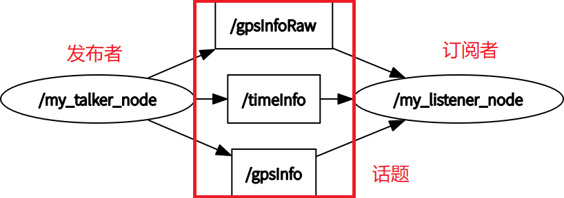  

</center>

</details>

## 2. [service 客户端、服务器](https://github.com/guannan-he/ROS/tree/main/src/service_req_rep)   

`ROS` 服务请求与应答示例

<details open>

`my_client_node` 向 `my_server_node` 发送服务请求, `my_server_node` 视数据有效性决定是否拒绝服务  

**运行命令**  

```
roslaunch service_req_rep service_req_rep.launch
```  

<center>

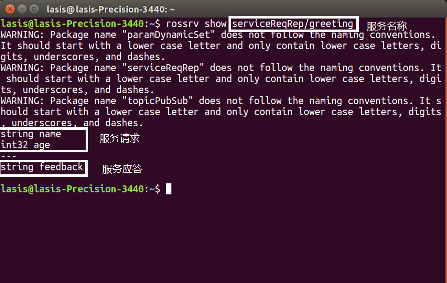  

</center>

</details>

## 3. [param 服务器](https://github.com/guannan-he/ROS/tree/main/src/param_dynamic_set)  

`ROS` 参数服务器示例, 与服务订阅联合示例  

<details open>

`dynamic_configure_node` 收到参数变化请求后调用 `myParamDynamicSetCallServer` 提供的服务  

**运行命令**  

```
roslaunch param_dynamic_set param_dynamic_set.launch
```  

<center>

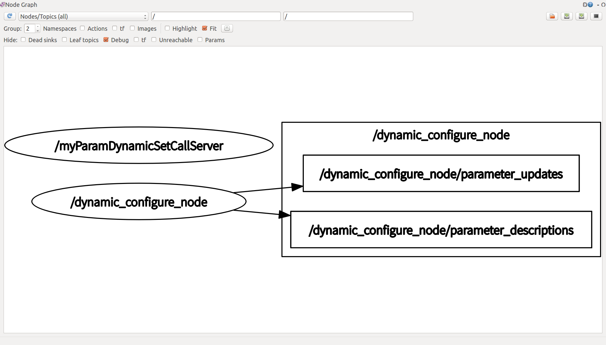  

</center>

</details>

## 4. [小乌龟TF](https://github.com/guannan-he/ROS/tree/main/src/learning_tf)  

`TF` 订阅、发布示例

<details open>

通过键盘控制乌龟1位置, 乌龟2订阅TF树上`乌龟1上参考点`相对于`乌龟2`的变换, 乌龟2跟踪该变换并设法使变换归零. 跟踪目标可以通过`start_demo.launch`修改  

**运行命令**  

```
roslaunch learning_tf start_demo.launch
```  

<center>

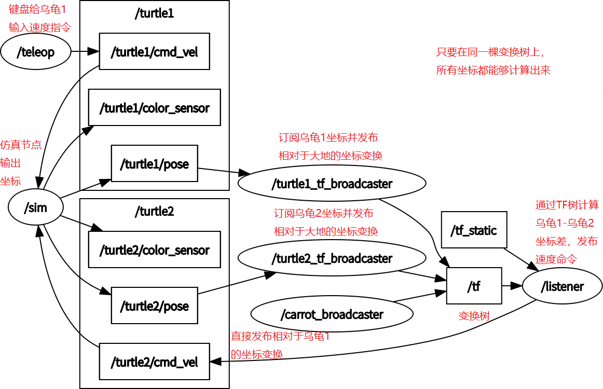  

</center>

</details>

## 5. [动作服务器](https://github.com/guannan-he/ROS/tree/main/src/action_server_client)  

简单动作服务器示例  

<details open>

`randNumGen` 生成随机数发布到 `randomNumber` 话题, `avgActionClient` 设定目标并接受 avgActionServer 提供的反馈  

**运行命令**  

```
roslaunch action_server_client server_and_client_avg.launch
```  

<center>

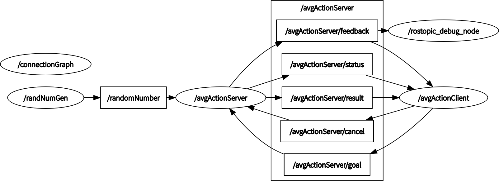  

</center>

</details>

## 6. [pluginlib](https://github.com/guannan-he/ROS/tree/main/src/my_pluginlib_learning)  

`ROS` 插件编写、注册机制示例与教程  

<details open>

pluginlib 利用面向对象编程的继承概念, 在`基类`中定义方法, 在`继承类`中实现  
推荐使用`公有继承`  

**运行命令**  

```
roslaunch my_pluginlib_learning plugin_param_demo.launch
```  

**ROS中插件注册插件流程**  

1) 编写`基类`和`继承类`的头文件, 并使`继承类`继承`基类`的接口  
2) 新建`源文件`并分别添加`基类`和`继承类`的头文件、`pluginlib/class_list_macros.h`头文件
3) 在`源文件`中使用 `PLUGINLIB_EXPORT_CLASS(`继承类`, `基类`)` 指定`基类`和`继承类`的关系  

4) 在 CMakeLists.txt 中添加如下代码以生成名为`lib插件名称.so`的动态链接库  

    ```
    add_library(插件名称 源文件)
    target_link_libraries(插件名称 ${catkin_LIBRARIES})
    ```

5) 新建`插件描述.xml`对插件继承关系进行描述  

    ```
    <library path = "lib/lib插件名称">
        <class name = "任意起一个名字" type = "继承类" base_class_type = "基类">
            <description>继承类用途描述</description>
        </class>
    </library>
    ```

6) 在`package.xml`中`<export>`标签下添加如下代码, 将该插件注册到某一插件库中  

    ```
    <插件库名称 plugin = "${prefix}/插件描述.xml"/>
    ```  

7) 编译后在终端中输入如下代码检查插件时否正确注册  

    ```
    rospack plugins --attrib=plugin 插件库名称
    ```  
    
8) 在源文件中使用`基类`生成`继承类`实例, 查看[plugin_caller.cpp](https://github.com/guannan-he/ROS/blob/main/src/my_pluginlib_learning/src/plugin_caller.cpp)查看具体使用方式, 生成`继承类`既可以使用`插件描述.xml`中定义的名字, 也可以使用`继承类`名称  

</details>

## 7. [nodelet](https://github.com/guannan-he/ROS/tree/main/src/my_nodelet_learning)  

`pluginlib` 的一种使用方式： `nodelet`  

<details open>

`string_publisher` 节点发布消息到 `input` 话题  
`nodelet_manager_1` 下注册 `subPubInstance1` 、`subPubInstance2` 和 `myNodeLetxx`  
节点管理器下挂节点通过管理器对外订阅或发布话题  

**运行命令**  

```
roslaunch my_nodelet_learning my_nodelet_launch.launch
```  

**nodelet 与 pluginlib 具有相似性**  

1) 都需要继承于一个`基类`  
2) 都需要在一个源文件中使用`PLUGINLIB_EXPORT_CLASS`宏  
3) 都需要在在`CMakeLists.txt`中声明`add_library`  
4) 都会生成动态链接库  
5) 都需要`插件描述.xml`  
6) 都需要在`package.xml`中进行注册  

**不同点在于**  

1) nodelet 只能继承`nodelet::Nodelet`类  
2) nodelet 运行时必须依托一个管理节点, 将不同 nodelet 注册到一个管理节点实现数据的指针传递  
3) 插件必须注册到`nodelet`库中  
4) 在 [launch](https://github.com/guannan-he/ROS/blob/main/src/my_nodelet_learning/launch/my_nodelet_launch.launch) 文件中使用如下命令指定 nodelet 类型  

    ```
    load nodelet名 管理节点名称
    ```

**注意**  

1) nodelet 中使用`getPrivateNodeHandle()`获取私有节点控制权, 使用`ros::NodeHandle`获取的是 nodelet 管理节点的控制权, 详情查看[my_nodelet_register.cpp](https://github.com/guannan-he/ROS/blob/main/src/my_nodelet_learning/src/my_nodelet_register.cpp)  
2) 管理节点是一个**抽象的**节点, 不同类型的 nodelet 可以注册到一个管理节点上  
3) 管理器下挂所有节点均通过节点管理器与外界交流  
4) nodelet **可能**支持服务, 但并**未**进行尝试

<center>

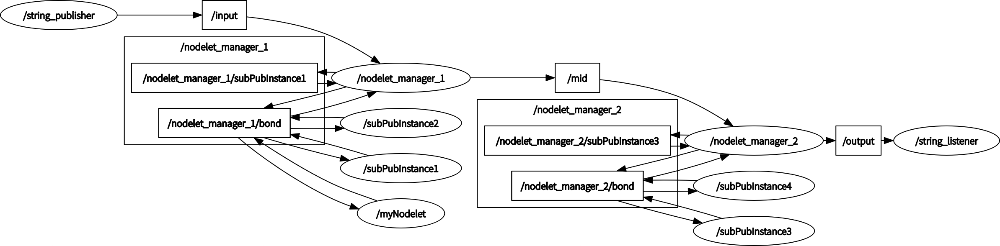  

</center>

</details>

## 8. [lasis_vehicle](https://github.com/guannan-he/ROS/tree/main/src/lasis_autonomous_vehicle)  

轨迹规划算法开发仿真包, 提供全剧规划与局部规划两种接口.  
与 `my_global_planner_plugin` 与  `my_local_planner_plugin` 配合使用  

<details open>

使用经过[北京邮电大学](https://github.com/xmy0916/racecar)修改过的[MIT模型](https://github.com/mit-racecar)  
需要安装如下依赖(**如果已经使用过本文件开头的命令, 可忽略**)    

```
sudo apt-get install ros-melodic-controller-manager
sudo apt-get install ros-melodic-gazebo-ros-control
sudo apt-get install ros-melodic-effort-controllers
sudo apt-get install ros-melodic-joint-state-controller
sudo apt-get install ros-melodic-driver-base
sudo apt-get install ros-melodic-rtabmap-ros
sudo apt-get install ros-melodic-teb-local-planner
sudo apt-get install ros-melodic-vesc*
sudo apt-get install ros-melodic-ackermann-*
sudo apt-get install ros-melodic-joystick-drivers
```

**启动命令1**：带键盘控制的最小化系统（无`amcl`和`move_base`）
```
roslaunch lasis_launch spawn_racecar.launch
```
  
**启动命令2**：在`启动命令1`的基础上使用`gmapping`算法建图  

> 如需保存地图, 需在命令行中添加`save_map_option:=true`参数  
  
```
roslaunch lasis_launch gmapping.launch
```

<center>

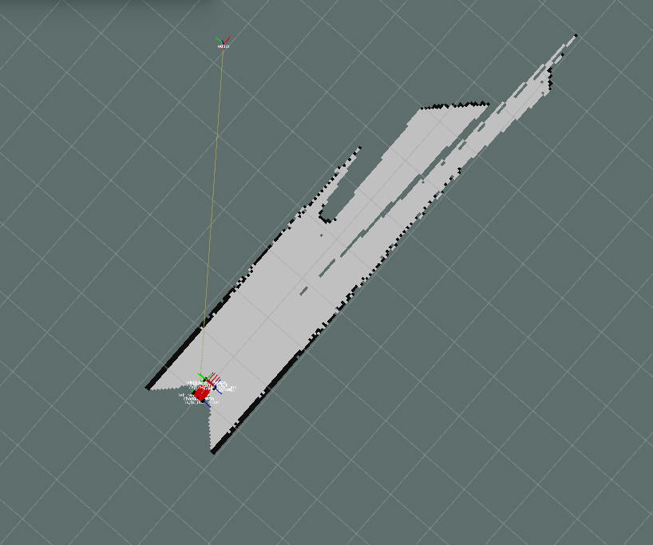

</center>

**启动命令3**：在`启动命令1`的基础上使用`move_base`节点进行规划, 使用`amcl`定位, `odom`由gazebo获取  
> 如果要直接使用gazebo发布变换, 需在命令行中添加`use_amcl:=false`参数  
**暂时使用`cmd_vel_to_ackermann_drive`节点作为`ackermann_msgs`发布器**  
**正在编写从`nav_msgs::path`到`ackermann_msgs`的节点**  
  

```
roslaunch lasis_launch navigation.launch
```

<center>

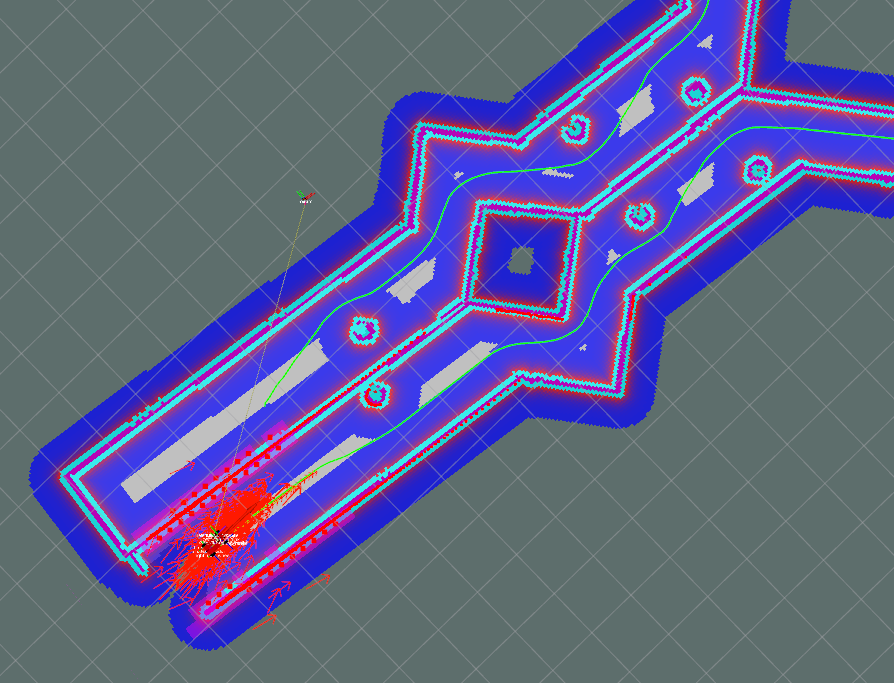

</center>

### **ackermann_cmd_mux 详解**  
> racecar中`ackermann_cmd_mux`模块负责处理不同优先级的阿克曼底盘速度指令  
通过命名空间和[nodelet](https://github.com/guannan-he/ROS#7-nodelet)划分为上下两个层级, 描述文件位于[mux.launch](https://github.com/guannan-he/ROS/blob/main/src/lasis_autonomous_vehicle/racecar/launch/mux.launch)  
上层控处理不同优先级的导航控制命令并发送给下层  
下层按照`遥控`、`安全`、`导航`顺序处理底盘控制指令  
上层输出到下层的导航控制指令通过`relay`进行连接  

> `ackermann_cmd_mux`模块允许自定义**不同优先级**的**同数据类型**话题  
上层优先级定义文件为[high_level_mux.yaml](https://github.com/guannan-he/ROS/blob/main/src/lasis_autonomous_vehicle/racecar/config/racecar-v2/high_level_mux.yaml)  
下层优先级定义文件为[low_level_mux.yaml](https://github.com/guannan-he/ROS/blob/main/src/lasis_autonomous_vehicle/racecar/config/racecar-v2/low_level_mux.yaml)  

<center>

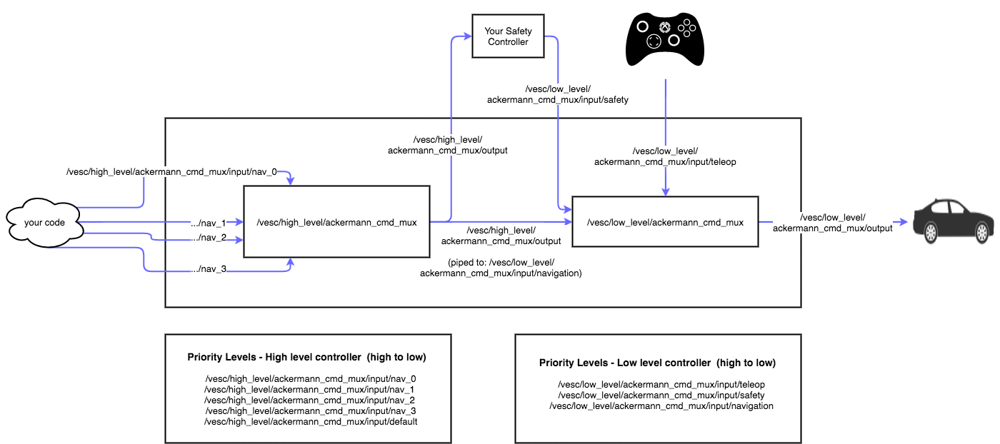  
图片来源：[mit-racecar.github.io](https://mit-racecar.github.io/icra2019-workshop/lab-wall-follow-hardware)

</center>
  
### **odom 与 amcl 详解**  
> `odom`指里程计, 可以理解为由编码器、惯导、GNSS、视觉里程计等传感器发布的消息信息, 经过航位推测法(Dead Reckoning)推算出的**车辆相对于出发点位置**, 通常使用`robot_pose_ekf`节点对以上数据进行融合, 然后发布以`/odom`为根节点, 以`/base_link`为叶子节点的`TF`变换.  

> 由于`odom`不可避免的存在漂移(Odometry Drift), 需要使用**车辆所在位置的局部信息**如雷达点云`/scan`等对该误差进行估计(校正).`amcl`节点提供该算法, `amcl`指自适应蒙特卡洛定位, 使用粒子滤波算法, **估计出车辆在地图中**最可能的位置, 然后发布以`/map`为根节点, 以`/odom`为叶子节点的`TF`变换, 对误差进行校正.  

<center>

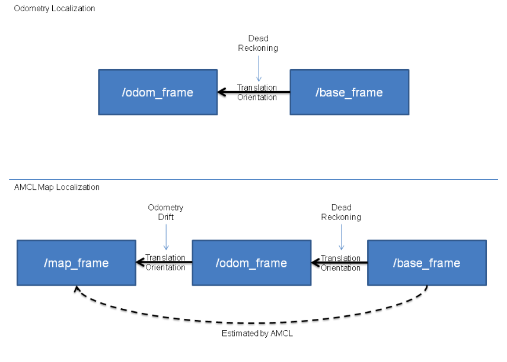

图片来源：[answers.ros.org](https://answers.ros.org/question/300999/confused-with-amcl-map-to-odom-transform/)  

</center>

启动命令3提供两种定位方法, gazebo定位与amcl定位, 其`TF`树差异如下  
<center>

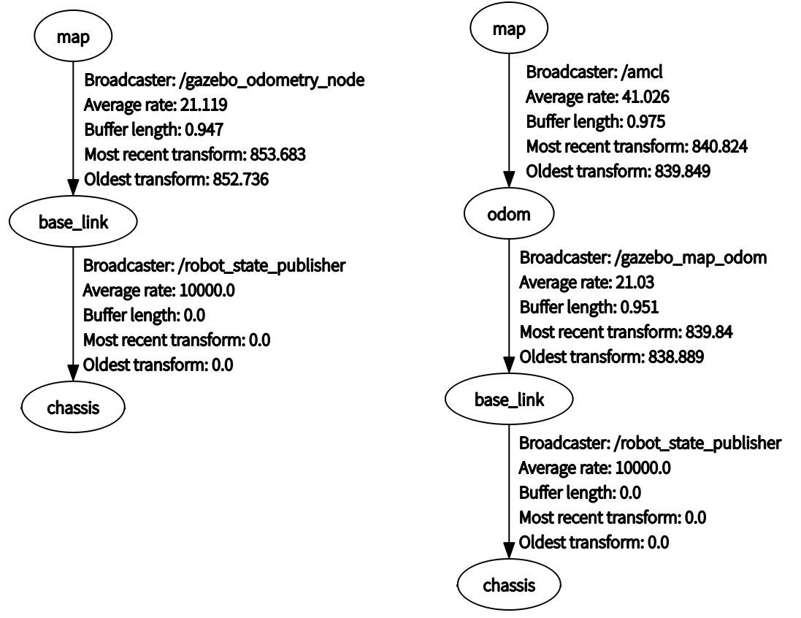

</center>

**待续**  

</details>

## 9. [my_global_planner_plugin](https://github.com/guannan-he/ROS/tree/main/src/my_global_planner_plugin)  

全局轨迹规划算法开发工具包, 提供测试工具、 `rviz` 接口、几种规划算法对比

<details open>

需要与 `move_base` , `TF` 配合使用, `lasis_vehicle` 已包含当前包功能  
提供下列节点供测试

1) `click_point_make_plan` 使用 rviz 中发布点功能, 调用`make_plan()`函数并发布路径  
2) `kernelTest` 直接调用 `myRosDijkstra` 内核进行规划  

提供下列全局路径规划器  

1) `myCarrot planner` 起点指向终点的路径, 遇到障碍结束  
2) `myAStar planner` 基于像素的 `AStar` 算法
3) `myDijkstra planner` 基于像素的 `Dijkstra` 算法
4) `myRosDijkstra planner` 基于势能场的 `Dijkstra` 算法, 并使用 `wrapper` 包装, 方便调试  
   
**测试命令**  

```
roslaunch my_global_planner_plugin kernelDebug.launch
```  
**结果**  
1) `myCarrot` 

<center>
 
  

</center>

2) `myAStar`  

<center>

  

</center>

3) `myDijkstra`  

<center>

  

</center>

4) `myRosDijkstra`  

<center>

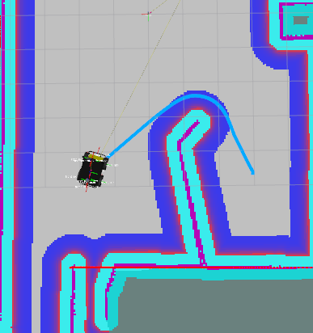  

</center>
  
</details>

## 10. [my_local_planner_plugin](https://github.com/guannan-he/ROS/tree/main/src/my_local_planner_plugin)  

局部轨迹规划算法开发工具包, 提供测试工具、 `rviz` 接口、几种规划算法对比  

提供下列局部轨迹规划器  

1) `TrajectoryPlannerROS` 用于差分底盘, 控制空间采样仿真  
2) `TebLocalPlannerROS` 用于阿克曼底盘, 优化方法

**启动命令1**：`base_local_planner` 作为局部轨迹规划器
```
roslaunch lasis_launch navigation.launch local_planner:=base_local_planner/myBaseLocalPlannerROS
```

**启动命令2**: `TebLocalPlannerROS` 作为局部轨迹规划器
```
roslaunch lasis_launch navigation.launch local_planner:=teb_local_planner/TebLocalPlannerROS
```

<details open>

`ROS` 中局部规划算法的基类为 `nav_core::BaseLocalPlanner` , 提供如下四个接口供 `move_base` 调用  

```c++
// 计算底盘控制指令
virtual bool computeVelocityCommands(geometry_msgs::Twist& cmd_vel) = 0;
// 是否完成对全局路径规划的跟踪
virtual bool isGoalReached() = 0;
// 设定全局全局路径规划位姿
virtual bool setPlan(const std::vector<geometry_msgs::PoseStamped>& plan) = 0;
// 初始化局部轨迹规划器
virtual void initialize(std::string name, tf2_ros::Buffer* tf, costmap_2d::Costmap2DROS* costmap_ros) = 0;
```

### **`TrajectoryPlannerROS` 详解**  

`ROS` 中差分机器人底盘默认局部路径规划器为 `base_local_planner/TrajectoryPlannerROS` , 主要算法为 `state lattice`: 在控制空间中采样控制量并对机器人在这组控制量下的轨迹进行仿真并评分, 找到代价最小的轨迹作为最优轨迹. 由算法核心与 ROS 包装层组成, 其工作流程图由 [CSDN用户 BRAND-NEO](https://blog.csdn.net/Neo11111/article/details/104660830) 整理, 可归纳为： 
 
1) `move_base` 节点使用 `pluginlib` 方式创建 `TrajectoryPlannerROS` 对象作为包装层, 在其构造函数中创建算法对象 `TrajectoryPlanner` , 调用接口为 `TrajectoryPlannerROS::initialize` 
2) 当全局路径规划结果发生变化时, `move_base` 调用 `TrajectoryPlannerROS::setPlan` 对追踪目标进行更新, `TrajectoryPlannerROS` 储存全局路径规划并将当前状态设置为**未到达终点** 
3) `move_base` 节点**周期调用** `TrajectoryPlannerROS::computeVelocityCommands` 和 `TrajectoryPlannerROS::isGoalReached` 计算底盘控制指令并检查是否完成追踪
4) 在 `TrajectoryPlannerROS::computeVelocityCommands` 中, `TrajectoryPlannerROS` 将全局路径规划变换到局部代价图上并对规划进行裁减, 然后根据底盘是否在运动、距离终点距离、决定轨迹生成方式并生成底盘控制指令, 轨迹生成算法核心函数为 `TrajectoryPlanner::generateTrajectory` , 详细参考[Base Local Planner 源码解读-1](https://blog.csdn.net/Neo11111/article/details/104660830)  
5) `TrajectoryPlanner::createTrajectories` 在控制空间中采样并调用轨迹生成函数, `TrajectoryPlanner::generateTrajectory` 对机器人在采样控制量下运动轨迹进行仿真并评分, 详细参考[Base Local Planner 源码解读-2](https://blog.csdn.net/Neo11111/article/details/104713086)  

<center>

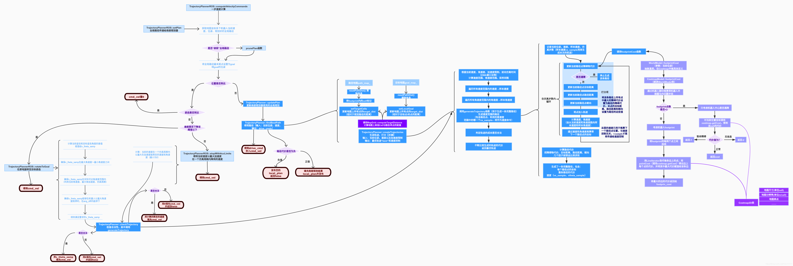  
图片来源：[CSDN用户 BRAND-NEO](https://blog.csdn.net/Neo11111/article/details/104660830)  

</center>

### **`TebLocalPlannerROS` 详解**  

move_base 节点并不是针对阿克曼底盘设计, 底盘控制指令为控制差分底盘的 [`geometry_msgs/Twist`](http://docs.ros.org/en/api/geometry_msgs/html/msg/Twist.html), 而不是阿克曼底盘控制指令 [`ackermann_msgs/AckermannDriveStamped`](http://docs.ros.org/en/api/ackermann_msgs/html/msg/AckermannDriveStamped.html). 但因前者具有六自由度而后者仅具有二自由度, 因此 [`geometry_msgs/Twist`](http://docs.ros.org/en/api/geometry_msgs/html/msg/Twist.html) 仍可用于阿克曼底盘. `TebLocalPlannerROS` 通过添加 最小转弯半径约束解决该两种底盘运动方式不同的问题：  

<center>


</center>  

注意: 使用 `TebLocalPlannerROS` 时推荐**关闭** `move_base` 节点的 `escape` 功能! 

`TebLocalPlannerROS` 的主要方法是使用 `g2o` 优化 `TimedElasticBand` 对象

<center>

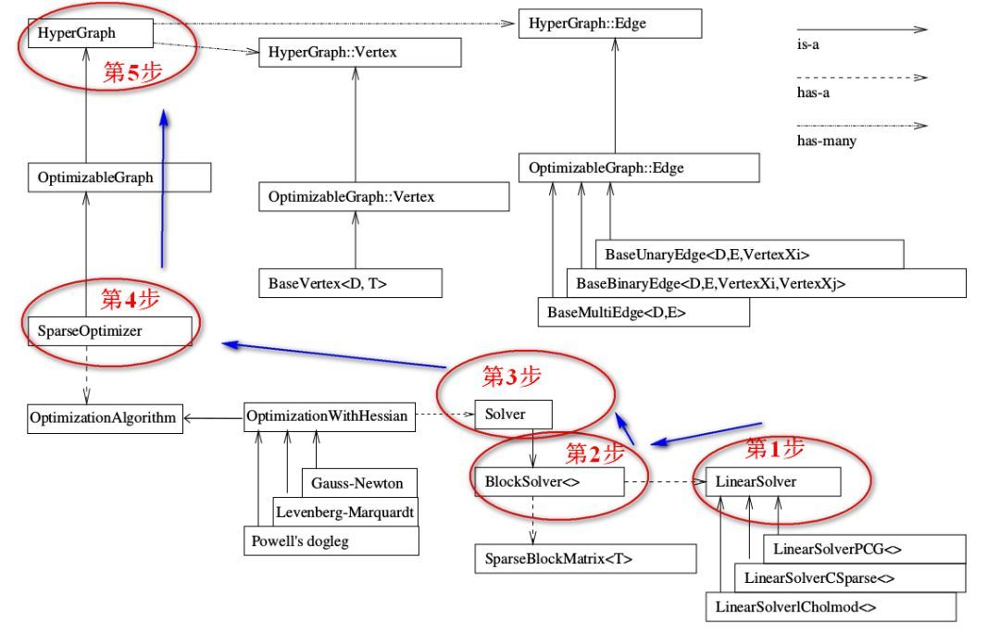  
图片来源：[腾讯云 小白学视觉](https://cloud.tencent.com/developer/article/1439125)  

</center>

<center>

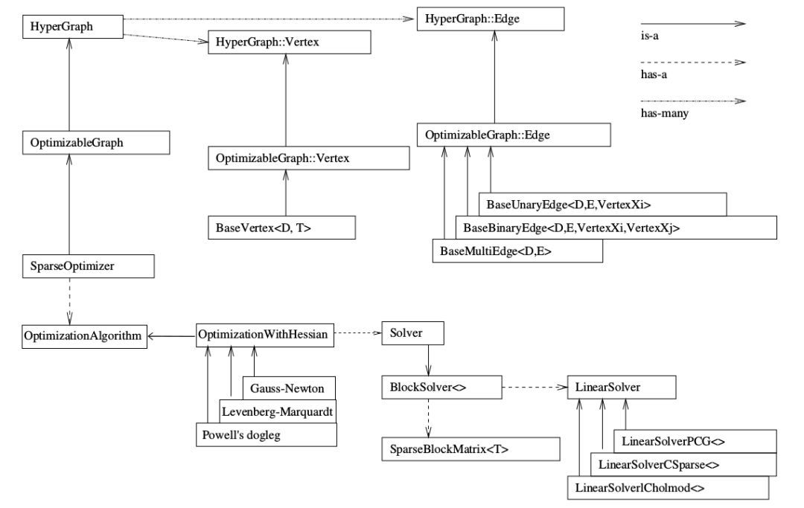  
图片来源：[g2o学习笔记](https://www.jianshu.com/p/e16ffb5b265d)  

</center>

### **局部轨迹规划效果对比**  
1) `base_local_planner/TrajectoryPlannerROS` 效果欠佳  

<center>

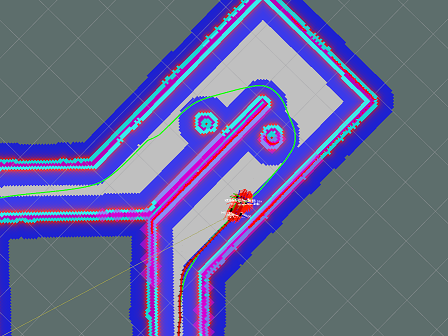  

</center>

2) `teb_local_planner/TebLocalPlannerROS` 使用底盘运动学限制，效果良好 

<center>
 
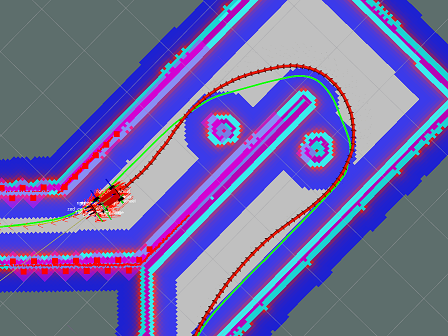  

</center>

</details>

---

# 更新日志
- 20210416 `TF` 变换学习
- 20210420 `actionlib` 动作服务器学习
- 20210421 动态参数调节学习, 使用类进行参数服务器与服务段封装
- 20210424 `pluginlib` 插件类加载方法学习
- 20210426 `nodelet` 学习
- 20210513 添加 `my_global_planner_plugin` 局部路径规划插件
- 20210519 仿照`navfn`优化`dijkstra`算法, 并使用`wrapper`包装新增调试节点
- 20210524 在`lasis_car`中使用`racecar`模型
- 20210527 `amcl`上线
- 20210528 新增`move_base`节点, `navigation`基础功能完成
- 20210601 迁移到 `ROS melodic` 发行版
- 20210615 添加 `my_local_planner_plugin` 局部路径规划插件
- 20210616 修复使用 `TebLocalPlannerROS` 时小车陷入局部最优解问题

# 已知问题  

- 抄来的 `base_local_planner` 原地打方向, 已解决
- 使用差速规划器控制阿克曼底盘效果不理想，代解决
    
# References  
[pluginlib_tutorials](https://github.com/huchunxu/ros_blog_sources/tree/master/pluginlib_tutorials)  
[如何配置VSCode来调试ROS节点](https://haoqchen.site/2019/08/15/debug-ros-with-vscode/)  
[北邮-智能车](https://github.com/xmy0916/racecar)  
[carrot planner](http://wiki.ros.org/navigation/Tutorials/Writing%20A%20Global%20Path%20Planner%20As%20Plugin%20in%20ROS)  
[aStar planner& dijkstra planner](https://zhuanlan.zhihu.com/p/113662488)  
[NavFnROS中势能计算](https://github.com/locusrobotics/robot_navigation/tree/master/dlux_global_planner#the-kernel)   
[AMZ-driverless](https://github.com/AMZ-Driverless/fssim)  
[MIT-RACECAR](https://github.com/mit-racecar)  
[MIT racecar 2016 team 5 project blog](6.141-spring-2016-team-5-documentation)  
[MIT ICRA'19 tutorial](https://mit-racecar.github.io/icra2019-workshop/)  
[Publishing Odometry Information over ROS
](http://wiki.ros.org/navigation/Tutorials/RobotSetup/Odom)  
[amcl详解-csdn](https://blog.csdn.net/chenxingwangzi/article/details/50038413)  
[Base Local Planner 源码解读-1](https://blog.csdn.net/Neo11111/article/details/104660830)  
[Base Local Planner 源码解读-2](https://blog.csdn.net/Neo11111/article/details/104713086)  
[Base Local Planner 源码解读-3](https://blog.csdn.net/Neo11111/article/details/104720103)  
[ros-planning/navigation/base_local_planner](https://github.com/ros-planning/navigation/tree/melodic-devel/base_local_planner)  
[rst-tu-dortmund/teb_local_planner](https://github.com/rst-tu-dortmund/teb_local_planner)  
[Trajectory modification considering dynamic constraints of autonomous robots](https://ieeexplore.ieee.org/document/6309484)  
[Kinodynamic Trajectory Optimization and Control for Car-Like Robots](https://ieeexplore.ieee.org/document/8206458)  
[g2o学习笔记](https://www.jianshu.com/p/e16ffb5b265d)  
[graph slam tutorial : 从推导到应用1](https://heyijia.blog.csdn.net/article/details/47686523)  
[graph slam tutorial : 从推导到应用2](https://heyijia.blog.csdn.net/article/details/47731631)  
[graph slam tutorial : 从推导到应用3](https://heyijia.blog.csdn.net/article/details/47428553)  