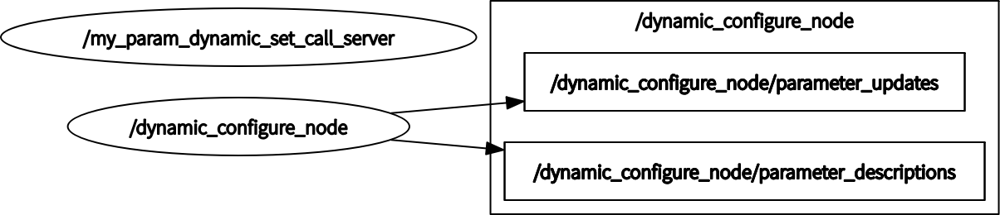

# ROS packages
1. topic 发送订阅:  
    my_talker_node 通过三个话题向 my_listener_node 发送两种消息  
    运行命令：  
    ‘‘’  
    roslaunch topic_pub_sub topic_pub_sub.launch  
    ’‘’  
    [topic_pub_sub](https://github.com/guannan-he/ROS/tree/main/src/topic_pub_sub)  
      
2. service 客户端、服务器:  
    my_client_node 向 my_server_node 发送服务请求，my_server_node 视数据有效性决定是否拒绝服务  
    [service_req_rep](https://github.com/guannan-he/ROS/tree/main/src/service_req_rep)  
      
3. param 服务器:  
    dynamic_configure_node 收到参数变化请求后调用 myParamDynamicSetCallServer 提供的服务  
    [param_dynamic_set](https://github.com/guannan-he/ROS/tree/main/src/param_dynamic_set)  
      
4. 小乌龟TF:  
    通过键盘控制乌龟1位置，乌龟2订阅TF树上「乌龟1上参考点」相对于「乌龟2」的变换，乌龟2跟踪该变换并设法使变换归零。跟踪目标可以通过「start_demo.launch」修改  
    [learning_tf](https://github.com/guannan-he/ROS/tree/main/src/learning_tf)  
      
5. 动作服务器:  
    randNumGen 生成随机数发布到 randomNumber 话题，avgActionClient 设定目标并接受 avgActionServer 提供的反馈  
    [topic_pub_sub](https://github.com/guannan-he/ROS/tree/main/src/action_server_client)  
      
6. pluginlib:  
7. nodelet:  
8. debug：
9. lasis_vehicle: 正在实现  
10. my_global_planner_plugin  
 
    
# references  
[pluginlib_tutorials](https://github.com/huchunxu/ros_blog_sources/tree/master/pluginlib_tutorials)  
[教程](https://haoqchen.site/2019/08/15/debug-ros-with-vscode/)  
[参考](https://github.com/xmy0916/racecar)  
[carrot planner](http://wiki.ros.org/navigation/Tutorials/Writing%20A%20Global%20Path%20Planner%20As%20Plugin%20in%20ROS)  
[aStar planner& dijkstra planner](https://zhuanlan.zhihu.com/p/113662488)  
[NavFnROS中势能计算](https://github.com/locusrobotics/robot_navigation/tree/master/dlux_global_planner#the-kernel) 

